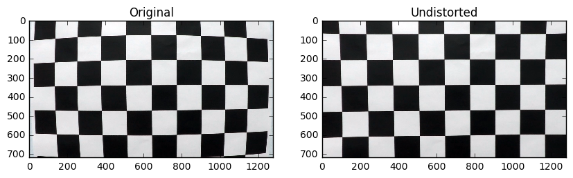
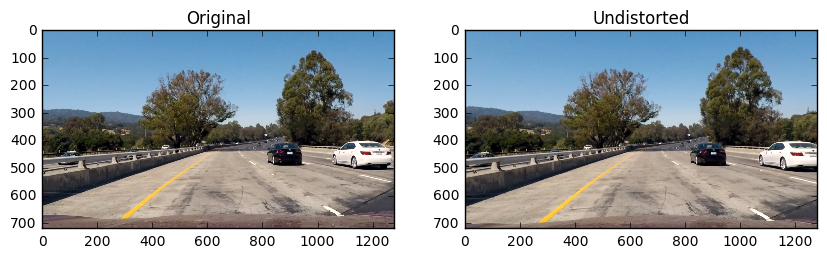
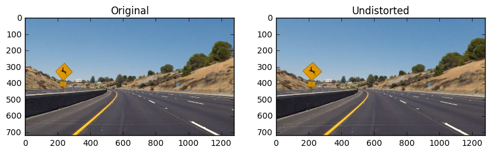
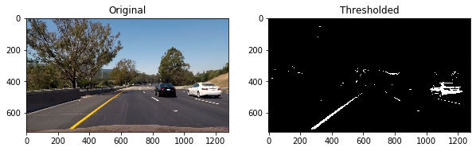
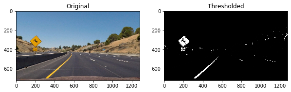
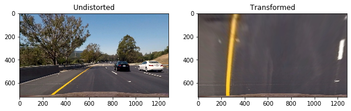
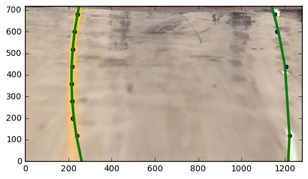
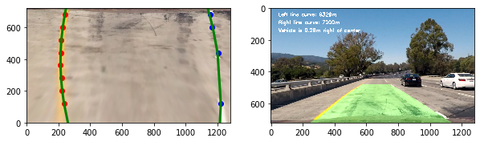

# Advanced Lane Finding

## Overview

A lane detection and tracking program that uses a traditional (i.e. non-machine-learning) computer vision approach to detect lane lines is implemented here.

  

### Dependencies

If you have already installed all the necessary dependencies for the projects in term 1 you should be good to go! If not, you should install them to get started on this project =>[Installations](https://github.com/udacity/CarND-Term1-Starter-Kit)

 
## Basic Build Instructions

1. Clone or fork this repository.
2. Launch the Jupyter notebook: `jupyter notebook Advanced_Lane_Finding.ipynb`
3. Execute the code cells you are interested in. 
Note that cells may depend on previous cells. The notebook explains clearly what each code cell does.

## Goal of this project

The goal of this project is to develop a pipeline to process a video stream from a forward-facing camera mounted on the front of a car, and output an annotated video which identifies:
- The positions of the lane lines 
- The location of the vehicle relative to the center of the lane
- The radius of curvature of the road

## Advanced Lane Detection Pipeline

The pipeline created for this project processes images in the following steps:
- **Step 0**: Compute the camera calibration matrix and distortion coefficients given a set of chessboard images. 
- **Step 1**: Apply distortion correction using a calculated camera calibration matrix and distortion coefficients.
- **Step 2**: Apply color thresholds to create a binary image which isolates the pixels representing lane lines.
- **Step 3**: Apply a perspective transformation to warp the image to a birds eye view perspective of the lane lines.
- **Step 4**: Identify the lane line pixels and fit polynomials to the lane boundaries.
- **Step 5**: Determine curvature of the lane and vehicle position with respect to center.
- **Step 6**: Output visual display of the lane boundaries and numerical estimation of lane curvature and vehicle position.

### Step 0: Camera Calibration (Preparation for pipeline)

I start by preparing "object points", which will be the (x, y, z) coordinates of the chessboard corners in the world. Here I am assuming the chessboard is fixed on the (x, y) plane at z=0, such that the object points are the same for each calibration image.  Thus, `objp` is just a replicated array of coordinates, and `objpoints` will be appended with a copy of it every time I successfully detect all chessboard corners in a test image.  `imgpoints` will be appended with the (x, y) pixel position of each of the corners in the image plane with each successful chessboard detection. I start with `9 corners` in `x-axis` and `6 corners` in `y-axis`. However, some of the calibration images only show a portion of the whole image and the we couldn't find `9` and `6` corners from them. As a result, I add a logic to search for fewer corners (e.g., `8 and 6`, `9 and 5`, etc.) once we couldn't detect corners from the original numbers. In this way, I'm able to find all the corners from the calibration images and able to use all of them for calibration.

I then used the output `objpoints` and `imgpoints` to compute the camera calibration and distortion coefficients using the `cv2.calibrateCamera()` function.  I applied this distortion correction to the test image using the `cv2.undistort()` function and obtained this result: 

### Step 1: Distortion Correction

Once the camera is calibrated, we can use the camera matrix and distortion coefficients we found to remove distortion from highway driving images. Indeed, if we want to study the *geometry* of the road, we have to be sure that the images we're processing do not present distortions. Here's the result of distortion-correction on one of the test images:

Notice that if you compare each two images, especially around the edges, there are obvious differences between the original and undistorted image, indicating that distortion has been removed from the original image.

To determine the curvature of the lane to predict the necessary steering angle for an autonomous car, we'll have to go through the following steps:
  - detect the lane lines using some masking and thresholding techniques
  - perform a perspective transform to get a birds eye view of the lane
  - fit a polynomial to the lane lines

### Step 2: Create a thresholded binary image

I used a combination of color and gradient thresholds to generate a binary image. The thresholds include:

 1. `Sobel` on `x` direction
 2. `Yellow` and `white` color detection from `RGB`
 3. `Yellow` and `white` color detection from `HSV`
 4. `Yellow` and `white` color detection from `HLS`
 5. `S channel` from `HLS`

A lot of credits are given to the community on `Slack` for the various ideas. The numbers for the thresholds are all hard-coded for now. A more robust approach will be explored later. Here's an example of my output for this step of the test image:

  

  

### Step 3: Perspective Transform

The `PerspectiveTransform()` function uses hard-coded pixel locations for both the original and new images and calculates the M and Minv matrices for perspective transform. Then, the M matrix is used by `cv2.warpPerspective` to convert the original image to its bird's view, while Minv is used to do transform in the opposite direction. Here's an example of my output for this step of the test image:

  

  

### Step 4: Fit a polynomial to the lane lines

 I use a histogram to find the locations of the maximum pixels along the `y-axis` and assume those are the locations of the points on the line. A `RejectOutlier` function is used to compare the `x-axis` value of all the points to their median value and reject the ones who are far away from the median. Last, a 2nd order polynomial is used to fit the lane lines such as:

  

### Steps 5: Determine curvature of the lane and vehicle position with respect to center

The calculation of the radius of curvature of the line is obtained from the lecture. The vehicle position is determined by calculating the average `x coordinate` of the bottom left and bottom right points of the lines and comparing it with the middle point of the `x-axis`(i.e., 640). The deviation is then converted from pixels to meters. If the deviation is postive, vehicle is to the right of the center. If the deviation is negative, vehicle is to the left of the center. An example is shown as below:

  

### Step 6: Output visual display of the lane boundaries and numerical estimation of lane curvature and vehicle position.
Subsequently the distance from center and radius of curvature was printed to the final annotated image.

  

All other test images can be found in [./output_images/](./output_images/)

## Video Processing Pipeline:

After establishing a pipeline to process still images, the final step was to expand the pipeline to process videos frame-by-frame, to simulate what it would be like to process an image stream in real time on an actual vehicle. The output video is given below,

||

## Reflection

The problems I encountered were almost exclusively due to lighting conditions, shadows, discoloration, etc.

I've considered a few possible approaches for making my algorithm more robust. These include more dynamic thresholding designating a confidence level for fits and rejecting new fits that deviate beyond a certain amount

